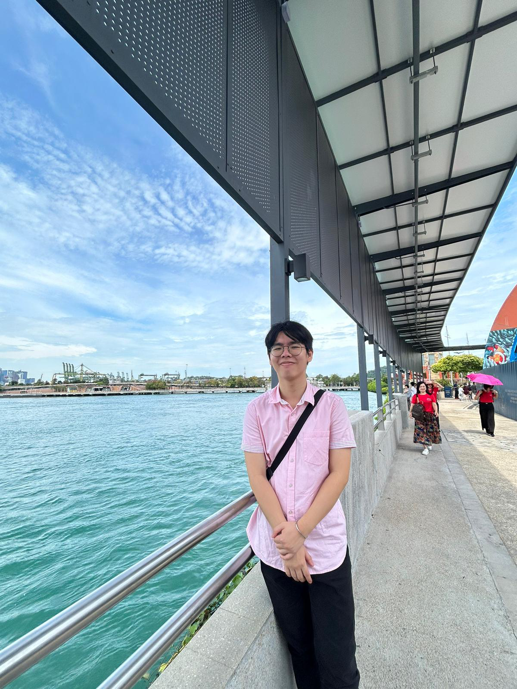

We are a team based in the [School of Computing, National University of Singapore](https://www.comp.nus.edu.sg).

You can reach us at the email `seer[at]comp.nus.edu.sg`

## Project team

### Dexter Kwan

[[github](https://github.com/dexterkwxn)]

* Role: Executive sub-GenAI Code Monkey

### Thaddeus Lim

[[github](http://github.com/lyhthaddeus)]
[[portfolio](team/johndoe.md)]

* Role: Underpaid Intern
* Responsibilities: Brings Coffee

### Johnny Doe

[[github](http://github.com/johndoe)] [[portfolio](team/johndoe.md)]

* Role: Developer
* Responsibilities: Data

### Jean Doe

[[github](http://github.com/johndoe)]
[[portfolio](team/johndoe.md)]

* Role: Developer
* Responsibilities: Dev Ops + Threading

### Avinash Parthiban

[[github](http://github.com/avinazz3)]
[[portfolio](team/avinash.md)]

* Role: Developer/100
* Responsibilities: Messing up git commands
