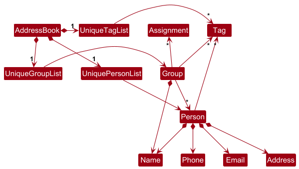

* Table of Contents
  {:toc}

--------------------------------------------------------------------------------------------------------------------

## **Acknowledgements**

* This project is based on the AddressBook-Level3 project created by the [SE-EDU initiative](https://se-education.org).

* {list here sources of all reused/adapted ideas, code, documentation, and third-party libraries -- include links to the original source as well}

--------------------------------------------------------------------------------------------------------------------

## **Setting up, getting started**

Refer to the guide [_Setting up and getting started_](SettingUp.md).

--------------------------------------------------------------------------------------------------------------------

## **Design**

:bulb: **Tip:** The `.puml` files used to create diagrams in this document `docs/diagrams` folder. Refer to the [_PlantUML Tutorial_ at se-edu/guides](https://se-education.org/guides/tutorials/plantUml.html) to learn how to create and edit diagrams.

### Architecture

The ***Architecture Diagram*** given above explains the high-level design of the App.

Given below is a quick overview of main components and how they interact with each other.

**Main components of the architecture**

**`Main`** (consisting of classes [`Main`](https://github.com/se-edu/addressbook-level3/tree/master/src/main/java/seedu/address/Main.java) and [`MainApp`](https://github.com/se-edu/addressbook-level3/tree/master/src/main/java/seedu/address/MainApp.java)) is in charge of the app launch and shut down.
* At app launch, it initializes the other components in the correct sequence, and connects them up with each other.
* At shut down, it shuts down the other components and invokes cleanup methods where necessary.

The bulk of the app's work is done by the following four components:

* [**`UI`**](#ui-component): The UI of the App.
* [**`Logic`**](#logic-component): The command executor.
* [**`Model`**](#model-component): Holds the data of the App in memory.
* [**`Storage`**](#storage-component): Reads data from, and writes data to, the hard disk.

[**`Commons`**](#common-classes) represents a collection of classes used by multiple other components.

**How the architecture components interact with each other**

The *Sequence Diagram* below shows how the components interact with each other for the scenario where the user issues the command `delete 1`.

Each of the four main components (also shown in the diagram above),

* defines its *API* in an `interface` with the same name as the Component.
* implements its functionality using a concrete `{Component Name}Manager` class (which follows the corresponding API `interface` mentioned in the previous point.

For example, the `Logic` component defines its API in the `Logic.java` interface and implements its functionality using the `LogicManager.java` class which follows the `Logic` interface. Other components interact with a given component through its interface rather than the concrete class (reason: to prevent outside component's being coupled to the implementation of a component), as illustrated in the (partial) class diagram below.

The sections below give more details of each component.

### UI component

The **API** of this component is specified in [`Ui.java`](https://github.com/se-edu/addressbook-level3/tree/master/src/main/java/seedu/address/ui/Ui.java)

The UI consists of a `MainWindow` that is made up of parts e.g.`CommandBox`, `ResultDisplay`, `PersonListPanel`, `StatusBarFooter` etc. All these, including the `MainWindow`, inherit from the abstract `UiPart` class which captures the commonalities between classes that represent parts of the visible GUI.

The `UI` component uses the JavaFx UI framework. The layout of these UI parts are defined in matching `.fxml` files that are in the `src/main/resources/view` folder. For example, the layout of the [`MainWindow`](https://github.com/se-edu/addressbook-level3/tree/master/src/main/java/seedu/address/ui/MainWindow.java) is specified in [`MainWindow.fxml`](https://github.com/se-edu/addressbook-level3/tree/master/src/main/resources/view/MainWindow.fxml)

The `UI` component,

* executes user commands using the `Logic` component.
* listens for changes to `Model` data so that the UI can be updated with the modified data.
* keeps a reference to the `Logic` component, because the `UI` relies on the `Logic` to execute commands.
* depends on some classes in the `Model` component, as it displays `Person` object residing in the `Model`.

### Logic component

**API** : [`Logic.java`](https://github.com/se-edu/addressbook-level3/tree/master/src/main/java/seedu/address/logic/Logic.java)

Here's a (partial) class diagram of the `Logic` component:

The sequence diagram below illustrates the interactions within the `Logic` component, taking `execute("delete 1")` API call as an example.

:information_source: **Note:** The lifeline for `DeleteCommandParser` should end at the destroy marker (X) but due to a limitation of PlantUML, the lifeline continues till the end of diagram.

How the `Logic` component works:

1. When `Logic` is called upon to execute a command, it is passed to an `AddressBookParser` object which in turn creates a parser that matches the command (e.g., `DeleteCommandParser`) and uses it to parse the command.
1. This results in a `Command` object (more precisely, an object of one of its subclasses e.g., `DeleteCommand`) which is executed by the `LogicManager`.
1. The command can communicate with the `Model` when it is executed (e.g. to delete a person). 
   Note that although this is shown as a single step in the diagram above (for simplicity), in the code it can take several interactions (between the command object and the `Model`) to achieve.
1. The result of the command execution is encapsulated as a `CommandResult` object which is returned back from `Logic`.

Here are the other classes in `Logic` (omitted from the class diagram above) that are used for parsing a user command:

How the parsing works:
* When called upon to parse a user command, the `AddressBookParser` class creates an `XYZCommandParser` (`XYZ` is a placeholder for the specific command name e.g., `AddCommandParser`) which uses the other classes shown above to parse the user command and create a `XYZCommand` object (e.g., `AddCommand`) which the `AddressBookParser` returns back as a `Command` object.
* All `XYZCommandParser` classes (e.g., `AddCommandParser`, `DeleteCommandParser`, ...) inherit from the `Parser` interface so that they can be treated similarly where possible e.g, during testing.

### Model component
**API** : [`Model.java`](https://github.com/se-edu/addressbook-level3/tree/master/src/main/java/seedu/address/model/Model.java)

The `Model` component,

* stores the address book data i.e., all `Person`, `Group` and `GroupMemberDetails` objects (which are contained in a `UniquePersonList` and `UniqueGroupList` object).
* stores the currently 'selected' `Person` or `Group` objects (e.g., results of a search query) as a separate _filtered_ list which is exposed to outsiders as an unmodifiable `ObservableList<Person>` that can be 'observed' e.g. the UI can be bound to this list so that the UI automatically updates when the data in the list change.
* stores a `UserPref` object that represents the user’s preferences. This is exposed to the outside as a `ReadOnlyUserPref` objects.
* does not depend on any of the other three components (as the `Model` represents data entities of the domain, they should make sense on their own without depending on other components)

:information_source: **Note:** An alternative (arguably, a more OOP) model is given below. It has a `Tag` list in the `AddressBook`, which `Person` references. This allows `AddressBook` to only require one `Tag` object per unique tag, instead of each `Person` needing their own `Tag` objects. 

* `Group` class contains an `ArrayListMap` object which acts similarly to a Map
* The `Person` objects are stored in the `Group` object as 'keys' of the `ArrayListMap` within `Group` object
* The values of the `ArrayListMap` would be the corresponding `GroupMemberDetail` object

### Storage component

**API** : [`Storage.java`](https://github.com/se-edu/addressbook-level3/tree/master/src/main/java/seedu/address/storage/Storage.java)

The `Storage` component is responsible for persisting address book data and user preferences to the hard disk. It handles the conversion between in-memory objects and their file representations.

#### Structure

The Storage component is organized into two main areas:

1. **AddressBook Storage**: Manages the reading and writing of address book data
    - `AddressBookStorage` interface defines the operations
    - `JsonAddressBookStorage` provides JSON-based implementation
    - Uses `JsonSerializableAddressBook` as an intermediate representation
    - Contains a hierarchy of JSON adapter classes that mirror the model structure:
        * `JsonAdaptedGroup` represents groups in the address book
        * `JsonAdaptedGroupMemberDetails` contains details about group membership
        * `JsonAdaptedPerson` and `JsonAdaptedAssignment` linked to group member details
        * `JsonAdaptedTag` represents tags associated with persons

2. **UserPrefs Storage**: Manages the reading and writing of user preferences
    - `UserPrefsStorage` interface defines the operations
    - `JsonUserPrefsStorage` provides JSON-based implementation

The `Storage` interface extends both `AddressBookStorage` and `UserPrefsStorage`, providing a unified API. `StorageManager` implements this interface and coordinates between both storage types.

#### Key Operations

**Reading Data**:
- Retrieves data via file paths specified in the storage implementations
- Converts JSON data to model objects through the adapter class hierarchy
- Returns `Optional` objects to handle cases where files don't exist
- Throws `DataLoadingException` when data cannot be loaded properly

**Writing Data**:
- Accepts model objects and converts them to JSON format using adapter classes
- Writes to specified file paths
- Throws `IOException` when writing fails
- Logs operations for debugging purposes

#### Design Considerations

* **Interface Segregation**: Separate interfaces allow for independent implementation and testing of different storage aspects
* **Adapter Pattern**: JSON adapter classes separate model concerns from persistence details
* **Complex Composition**: The JSON classes mirror the complex relationships in the model, including groups, group memberships, persons, assignments, and tags
* **Dependency Injection**: `StorageManager` takes concrete storage implementations as constructor parameters, facilitating testing and flexibility

This design provides clean separation of concerns, allowing the model to remain focused on business logic while the storage component handles persistence details. The hierarchy of JSON adapter classes supports the address book's ability to manage not just persons and tags, but also groups, group memberships, and assignments.

### Common classes

Classes used by multiple components are in the `seedu.address.commons` package.

--------------------------------------------------------------------------------------------------------------------

## **Implementation**

This section describes some noteworthy details on how certain features are implemented.

### Adding a person to a group

The sequence diagram below illustrate the process of adding a Person to a Group by writing the command `add-to-group P/ p g/ g`.
1. First the command will go through the standard logic sequence. Creating a Unique Command parser to parse input data to create
   a `AddPersonToGroupCommand` object
2. The `LogicManger` then execute the command by calling `execute(m)
3. `AddPersonToGroupCommand` will get the `Person` object to be added and the `Group` object to be added to from `Model`
4. Lastly, the `addPersonToGroup` method will be called to add the `Person` object into the `Group` object.
5. A `CommandResult` is returned for `Ui` purpose

The `Group` object will create a new `GroupMemberDetail` object tied to the newly added `Person` object and stored into the Map as a key-value pair.
6. After `addPersonToGroup` is called, the `Model` will call on the `VersionedAddressBook` to which adds `p:Person` to `g:Group`
7. `Group` will create a new `GroupMemberDetails` object that corresponds to `p:Person` object
8. Both the `p:Person` and the newly created `GroupMemberDetails` objects will be stored in an `ArrayListMap` within the `Group` object

### \[Proposed\] Undo/redo feature

#### Proposed Implementation

The proposed undo/redo mechanism is facilitated by `VersionedAddressBook`. It extends `AddressBook` with an undo/redo history, stored internally as an `addressBookStateList` and `currentStatePointer`. Additionally, it implements the following operations:

* `VersionedAddressBook#commit()` — Saves the current address book state in its history.
* `VersionedAddressBook#undo()` — Restores the previous address book state from its history.
* `VersionedAddressBook#redo()` — Restores a previously undone address book state from its history.

These operations are exposed in the `Model` interface as `Model#commitAddressBook()`, `Model#undoAddressBook()` and `Model#redoAddressBook()` respectively.

Given below is an example usage scenario and how the undo/redo mechanism behaves at each step.

Step 1. The user launches the application for the first time. The `VersionedAddressBook` will be initialized with the initial address book state, and the `currentStatePointer` pointing to that single address book state.

Step 2. The user executes `delete 5` command to delete the 5th person in the address book. The `delete` command calls `Model#commitAddressBook()`, causing the modified state of the address book after the `delete 5` command executes to be saved in the `addressBookStateList`, and the `currentStatePointer` is shifted to the newly inserted address book state.

Step 3. The user executes `add n/David …​` to add a new person. The `add` command also calls `Model#commitAddressBook()`, causing another modified address book state to be saved into the `addressBookStateList`.

:information_source: **Note:** If a command fails its execution, it will not call `Model#commitAddressBook()`, so the address book state will not be saved into the `addressBookStateList`.

Step 4. The user now decides that adding the person was a mistake, and decides to undo that action by executing the `undo` command. The `undo` command will call `Model#undoAddressBook()`, which will shift the `currentStatePointer` once to the left, pointing it to the previous address book state, and restores the address book to that state.

:information_source: **Note:** If the `currentStatePointer` is at index 0, pointing to the initial AddressBook state, then there are no previous AddressBook states to restore. The `undo` command uses `Model#canUndoAddressBook()` to check if this is the case. If so, it will return an error to the user rather
than attempting to perform the undo.

The following sequence diagram shows how an undo operation goes through the `Logic` component:

:information_source: **Note:** The lifeline for `UndoCommand` should end at the destroy marker (X) but due to a limitation of PlantUML, the lifeline reaches the end of diagram.

Similarly, how an undo operation goes through the `Model` component is shown below:

The `redo` command does the opposite — it calls `Model#redoAddressBook()`, which shifts the `currentStatePointer` once to the right, pointing to the previously undone state, and restores the address book to that state.

:information_source: **Note:** If the `currentStatePointer` is at index `addressBookStateList.size() - 1`, pointing to the latest address book state, then there are no undone AddressBook states to restore. The `redo` command uses `Model#canRedoAddressBook()` to check if this is the case. If so, it will return an error to the user rather than attempting to perform the redo.

Step 5. The user then decides to execute the command `list`. Commands that do not modify the address book, such as `list`, will usually not call `Model#commitAddressBook()`, `Model#undoAddressBook()` or `Model#redoAddressBook()`. Thus, the `addressBookStateList` remains unchanged.

Step 6. The user executes `clear`, which calls `Model#commitAddressBook()`. Since the `currentStatePointer` is not pointing at the end of the `addressBookStateList`, all address book states after the `currentStatePointer` will be purged. Reason: It no longer makes sense to redo the `add n/David …​` command. This is the behavior that most modern desktop applications follow.

The following activity diagram summarizes what happens when a user executes a new command:

#### Design considerations:

**Aspect: How undo & redo executes:**

* **Alternative 1 (current choice):** Saves the entire address book.
    * Pros: Easy to implement.
    * Cons: May have performance issues in terms of memory usage.

* **Alternative 2:** Individual command knows how to undo/redo by
  itself.
    * Pros: Will use less memory (e.g. for `delete`, just save the person being deleted).
    * Cons: We must ensure that the implementation of each individual command are correct.

_{more aspects and alternatives to be added}_

### \[Proposed\] Data archiving

_{Explain here how the data archiving feature will be implemented}_

--------------------------------------------------------------------------------------------------------------------

## **Documentation, logging, testing, configuration, dev-ops**

* [Documentation guide](Documentation.md)
* [Testing guide](Testing.md)
* [Logging guide](Logging.md)
* [Configuration guide](Configuration.md)
* [DevOps guide](DevOps.md)

--------------------------------------------------------------------------------------------------------------------

## **Appendix: Requirements**

### Product scope

**Target user profile**:

* is a Teaching Assistant
* has a need to manage a significant number of students/contacts
* prefer desktop apps over other types
* can type fast
* prefers typing to mouse interactions
* is reasonably comfortable using CLI apps

**Value proposition**: makes administrative work more convenient for a Teaching Assistant

### User stories

Priorities: High (must have) - `* * *`, Medium (nice to have) - `* *`, Low (unlikely to have) - `*`

| Priority | As a …​                                    | I want to …​                     | So that I can…​                                                        |
| -------- | ------------------------------------------ | ------------------------------ | ---------------------------------------------------------------------- |
| `* * *`  | Teaching Assistant   | Add a new contact with details such as name, contact and role  | Quickly access their information when required  |
| `* * *`  | Teaching Assistant   | Create and manage groups  |   Organize my contact based on my different responsibilities |
| `* * *`  | Teaching Assistant   | See the list of contact in my class list | Easily access the information when required |
| `* * *`  | Teaching Assistant   | Delete a contact | Remove students who have dropped / transferred my class |
| `* * *`  | Teaching Assistant   | Update a contact's detail | Update my information of my contact to the latest up-to-date information |
| `* *` | Teaching Assistant | Search for a contact by an identifier like name or role | I can quickly find a contact I need |
| `* *` | Teaching Assistant | Fileter contacts by role such as student/ TA or Professor | Organize my address book more efficiently |
| `* *` | Teaching Assistant | Mark certain contact with 'priority' | Quickly access te most important contacts |
| `* *` | Teaching Assistant | Add notes to a contact | Easily remember important details about the contact |
| `* *` | Teaching Assistant | Mark the attendance count of students | Keep track of attendence for grading |
| `*` | Teaching Assistant | Import contact list from a CSV file | Avoid manually inputting each contact |
| `*` | Teaching Assistant | Log interaction with students | Track who I have assisted and follow up if needed |
| `*` | Teaching Assistant | See an image of my student | Remember their faces and names easier |
| `*` | Teaching Assistant | Export my contact to a CSV file | Back up or share my contact list |
| `*` | Teaching Assistant | Track my student's homework submission status | Mark their work for grading |
| `*` | Teaching Assistant | Set reminders for specific contacts | Don't forget to follow up on important tasks |
| `*` | Teaching Assistant | Track whether I marked my student's homework | Ensrure I do not miss out any work during marking |
| `*` | Teaching Assistant | Track my students' grades | Assess my own teacing ability |
| `*` | Teaching Assistant | See the dates of upcoming tutorials and exams | Make the necessary preparations before hand |
| `*` | Teaching Assistant | See deadline for submission and other important dates | Remind my students to prepare for them |
| `*` | Teaching Assistant | Track the progress for preparations of my teaching material | Ensure it is completed before tutorials |
| `*` | Teaching Assistant | Plot a whisker plot of the current grade of my students | Track their learning progress and identify stuggling students |

### Use cases

(For all use cases below, the **System** is the `AddressBook` and the **Actor** is the `user`, unless specified otherwise)

### Use case: UC01 - Delete a person
{:.no_toc}

**MSS**

1. User requests to list persons
2. AddressBook displays persons
3. User requests to delete a specific person
4. AddressBook deletes the person

   Use case ends.

**Extensions**

* 2a. The list is empty.

  Use case ends.

* 3a. The given index is invalid.

    * 3a1. AddressBook indicates error.

      Use case resumes at step 2.

### Use case: UC02 - Adding a person
{:.no_toc}

**MSS**
1. User provides contact details
2. AddressBook adds the contact
3. AddressBook indicates success

   Use case ends.

**Extensions**

* 1a. The provided details are invalid.
    * 1a1. AddressBook indicates error.
    * 1a2. User provides valid details.

      Use case resumes from step 2.

### Use case: UC03 - Editing a Contact
{:.no_toc}

**MSS**
1. User requests to list persons
2. AddressBook displays persons
3. User requests to edit a specific person with new details
4. AddressBook updates the contact information
5. AddressBook indicates success

   Use case ends.

**Extensions**

* 2a. The list is empty.

  Use case ends.

* 3a. The given index is invalid.
    * 3a1. AddressBook indicates error.

      Use case resumes at step 2.

* 3b. The provided details are invalid.
    * 3b1. AddressBook indicates error.
    * 3b2. User provides valid details.

      Use case resumes from step 4.

### Use case: UC04 - Find a contact by name
{:.no_toc}

**Preconditions:**
- The address book contains at least one person.

**MSS:**
1. User requests to find persons by keyword(s)
2. AddressBook displays persons whose names contain the keyword(s)

   Use case ends.

**Extensions:**
* 2a. No person matches the keyword(s).
    * 2a1. AddressBook indicates no matches found.

      Use case ends.

* 1a. User provides invalid search parameters.
    * 1a1. AddressBook indicates error.

      Use case ends.

### Use case: UC05 - List all contacts
{:.no_toc}

**MSS:**
1. User requests to list all persons
2. AddressBook displays all persons

   Use case ends.

**Extensions:**
* 2a. The address book is empty.
    * 2a1. AddressBook indicates no contacts exist.

      Use case ends.

### Use case: UC06 - Mark attendance for a student
{:.no_toc}

**Preconditions:**
- The student exists
- The group exists
- The student is a member of the specified group

**MSS:**
1. User requests to mark attendance with student name, group name, and week number
2. AddressBook updates the attendance record
3. AddressBook indicates success

   Use case ends.

**Extensions:**
* 1a. Week number is invalid.
    * 1a1. AddressBook indicates error.

      Use case ends.

* 1b. Group does not exist.
    * 1b1. AddressBook indicates error.

      Use case ends.

* 1c. Student does not exist.
    * 1c1. AddressBook indicates error.

      Use case ends.

* 1d. Student is not a member of the specified group.
    * 1d1. AddressBook indicates error.

      Use case ends.

### Use case: UC07 - Unmark attendance for a student
{:.no_toc}

**Preconditions:**
- The student exists
- The group exists
- The student is a member of the specified group

**MSS:**
1. User requests to unmark attendance with student name, group name, and week number
2. AddressBook updates the attendance record
3. AddressBook indicates success

   Use case ends.

**Extensions:**
* 1a. Week number is invalid.
    * 1a1. AddressBook indicates error.

      Use case ends.

* 1b. Group does not exist.
    * 1b1. AddressBook indicates error.

      Use case ends.

* 1c. Student does not exist.
    * 1c1. AddressBook indicates error.

      Use case ends.

* 1d. Student is not a member of the specified group.
    * 1d1. AddressBook indicates error.

      Use case ends.

### Use case: UC08 - Show a student's attendance in a group
{:.no_toc}

**Preconditions:**
- The student exists
- The group exists
- The student is a member of the group

**MSS:**
1. User requests attendance records for a specific student in a specific group
2. AddressBook displays the attendance records

   Use case ends.

**Extensions:**
* 1a. Group does not exist.
    * 1a1. AddressBook indicates error.

      Use case ends.

* 1b. Student does not exist.
    * 1b1. AddressBook indicates error.

      Use case ends.

* 1c. Student is not a member of the specified group.
    * 1c1. AddressBook indicates error.

      Use case ends.

### Use case: UC09 - Add a group
{:.no_toc}

**Preconditions:**
- The group name is unique

**MSS:**
1. User requests to create a new group with a specified name
2. AddressBook creates the group
3. AddressBook indicates success

   Use case ends.

**Extensions:**
* 1a. A group with the same name already exists.
    * 1a1. AddressBook indicates error.

      Use case ends.

### Use case: UC10 - Delete a group
{:.no_toc}

**MSS:**
1. User requests to list groups
2. AddressBook displays groups
3. User requests to delete a specific group
4. AddressBook deletes the group
5. AddressBook indicates success

   Use case ends.

**Extensions:**
* 2a. The list is empty.

  Use case ends.

* 3a. The given index is invalid.
    * 3a1. AddressBook indicates error.

      Use case resumes at step 2.

### Use case: UC11 - Edit a group
{:.no_toc}

**MSS:**
1. User requests to list groups
2. AddressBook displays groups
3. User requests to edit a specific group with a new name
4. AddressBook updates the group name
5. AddressBook indicates success

   Use case ends.

**Extensions:**
* 2a. The list is empty.

  Use case ends.

* 3a. The given index is invalid.
    * 3a1. AddressBook indicates error.

      Use case resumes at step 2.

* 3b. The new group name already exists.
    * 3b1. AddressBook indicates error.

      Use case resumes at step 3.

### Use case: UC12 - Show group details
{:.no_toc}

**MSS:**
1. User requests to list groups
2. AddressBook displays groups
3. User requests details of a specific group
4. AddressBook displays the group's name and member list

   Use case ends.

**Extensions:**
* 2a. The list is empty.

  Use case ends.

* 3a. The given index is invalid.
    * 3a1. AddressBook indicates error.

      Use case resumes at step 2.

### Use case: UC13 - Find a group by name
{:.no_toc}

**Preconditions:**
- At least one group exists in the address book.

**MSS:**
1. User requests to find groups by keyword(s)
2. AddressBook displays groups whose names contain the keyword(s)

   Use case ends.

**Extensions:**
* 2a. No group matches the keyword(s).
    * 2a1. AddressBook indicates no matches found.

      Use case ends.

* 1a. User provides invalid search parameters.
    * 1a1. AddressBook indicates error.

      Use case ends.

### Use case: UC14 - List all groups
{:.no_toc}

**MSS:**
1. User requests to list all groups
2. AddressBook displays all groups

   Use case ends.

**Extensions:**
* 2a. No groups exist.
    * 2a1. AddressBook indicates no groups exist.

      Use case ends.

### Use case: UC15 - Add a person to a group
{:.no_toc}

**Preconditions:**
- The person exists
- The group exists
- The person is not already a member of the group

**MSS:**
1. User requests to add a person to a group
2. AddressBook adds the person to the group
3. AddressBook indicates success

   Use case ends.

**Extensions:**
* 1a. Person does not exist.
    * 1a1. AddressBook indicates error.

      Use case ends.

* 1b. Group does not exist.
    * 1b1. AddressBook indicates error.

      Use case ends.

* 1c. Person is already in the group.
    * 1c1. AddressBook indicates error.

      Use case ends.

### Use case: UC16 - Remove a person from a group
{:.no_toc}

**Preconditions:**
- The person exists
- The group exists
- The person is a member of the group

**MSS:**
1. User requests to remove a person from a group
2. AddressBook removes the person from the group
3. AddressBook indicates success

   Use case ends.

**Extensions:**
* 1a. Person does not exist.
    * 1a1. AddressBook indicates error.

      Use case ends.

* 1b. Group does not exist.
    * 1b1. AddressBook indicates error.

      Use case ends.

* 1c. Person is not a member of the group.
    * 1c1. AddressBook indicates error.

      Use case ends.

### Use case: UC17 - View help information
{:.no_toc}

**MSS:**
1. User requests help information
2. AddressBook displays help information

   Use case ends.

### Non-Functional Requirements

1.  Should work on any _mainstream OS_ as long as it has Java `17` or above installed.
2.  Should be able to hold up to 1000 persons without a noticeable sluggishness in performance for typical usage.
3.  A user with above average typing speed for regular English text (i.e. not code, not system admin commands) should be able to accomplish most of the tasks faster using commands than using the mouse.
4.  Should not require an internet connection for all functionalities.
5.  Should work well in multitasking scenarios, allowing TAs to switch between the app and other teaching tools (e.g., PDF readers, Excel) without performance degradation.
6.  Should be lightweight, running smoothly on the same laptops TAs use for general university tasks, without any additional hardware.
7.  Data should be backed up into a user-editable file format, making it easy to share across devices or with other TAs.
8.  Should be easily upgradable, allowing new versions or features to be added without disrupting existing user data or workflows.

*{More to be added}*

### Glossary

* **Mainstream OS**: Windows, Linux, Unix, MacOS
* **Contact**: An entry with details of a person of interest, i.e., a student, a teacher, or a teaching assistant
* **Private contact detail**: A contact detail that is not meant to be shared with others
* **Teaching assistant (TA)**: A person who assists in teaching a class; they are typically also a full-time student
* **Head TA**: The teaching assistant(s) in charge of all other teaching assistants for a particular course
* **Tutorial**: Lessons that students attend which complement the content taught in lectures; typically taught by TAs
* **Assignment/homework**: A set of deliverables that students have to submit regularly; typically comes with a grade
* **Exam**: A formal test of a student's understanding of the content in a course; typically comes with a grade

--------------------------------------------------------------------------------------------------------------------

## **Appendix: Instructions for manual testing**

Given below are instructions to test the app manually.

:information_source: **Note:** These instructions only provide a starting point for testers to work on;
testers are expected to do more *exploratory* testing.

### Launch and shutdown

1. Initial launch

    1. Download the jar file and copy into an empty folder

    1. Double-click the jar file Expected: Shows the GUI with a set of sample contacts. The window size may not be optimum.

1. Saving window preferences

    1. Resize the window to an optimum size. Move the window to a different location. Close the window.

    1. Re-launch the app by double-clicking the jar file. 
       Expected: The most recent window size and location is retained.

1. _{ more test cases …​ }_

### Deleting a person

1. Deleting a person while all persons are being shown

    1. Prerequisites: List all persons using the `list` command. Multiple persons in the list.

    1. Test case: `delete 1` 
        * Expected: First contact is deleted from the list. Details of the deleted contact shown in the status message. Timestamp in the status bar is updated.
        * Person that was deleted from the list should also be removed from all group it was previously part of. Can be verified using `list-group` to see all the groups.

    1. Test case: `delete 0` 
       Expected: No person is deleted. Error details shown in the status message. Status bar remains the same.

    1. Other incorrect delete commands to try: `delete`, `delete x`, `...` (where x is larger than the list size) 
       Expected: Similar to previous.

1. _{ more test cases …​ }_

### Saving data

1. Dealing with missing/corrupted data files

    1. _{explain how to simulate a missing/corrupted file, and the expected behavior}_

1. _{ more test cases …​ }_

### Manging Persons in Group

1. Adding a Person to a Group
    1. Prerequisites: `p:Person` is not a member of `g:Group`
    2. Test case: `add-to-group P/ p g/ g`  
       Expected: Person should show up inside `g:Group` when using either `list-group` or `find-group` commands
2. Adding a Person who already exist in the Group
    1. Prerequisite: `p:Person` is already a member of `g:Group`
    2. Test case: `add-to-group P/ p g/ g`  
       Expected: Error message indicating `p:Person` is already in `g:Group`. No duplicate entry should be created.
3. Deleting a Person from a Group
    1. Prerequisites: `p:Person` is already a member of `g:Group`
    2. Test case: `delete-from-group P/ p g/ g`  
       Expected: Person should no longer show up inside `g:Group` when using either `list-group` or `find-group` commands
4. Deleting a Person who is not a member of Group
    1. Prerequisite: `p:Person` is not a member of `g:Group`
    2. Test case: `delete-from-group P/ p g/ g`  
       Expected: Error message indicating `p:Person` does not exist in `g:Group`

## **Appendix: Effort**

The project required a considerable effort beyond the baseline AddressBook-Level3 (AB3), especially due to the introduction of a new domain entity: `Group`. While AB3 only deals with a flat structure of a single entity (`Person`), our project introduces a relational structure between `Group` and `Person`, along with additional responsibilities such as attendance tracking, role assignment, and performance logging through assignments.

### Key Challenges and Effort

- **Designing a New Entity Model**: Introducing `Group` was not a simple data addition — it required a full-fledged model (`Group.java`) capable of:
    - Maintaining its own identity and validation rules.
    - Tracking a collection of `Person` instances with unique roles and contextual data.
    - Persisting group-member-specific data such as attendance and assignment grades.

- **Extending Existing Entities**: To maintain separation of concerns, we introduced a new class `GroupMemberDetail.java` which bridges a `Person` and a `Group` and stores contextual information like:
    - Weekly attendance (`boolean[13]` per student).
    - Assignment grades (via a custom `ArrayListMap`).
    - Roles (e.g., Student, Teaching Assistant, Lecturer).

- **Cross-Entity Logic**: Unlike AB3's flat command structure, many features required verifying the existence and relationship of both `Person` and `Group` during execution (e.g., `mark-attendance`, `add-to-group`, `show-attendance`).

- **Storage Complexity**: Extending the storage layer to support nested structures like `Group -> GroupMemberDetail -> Person` required:
    - Custom serialization and deserialization logic.
    - Managing consistency between group membership and person identity.
    - Updating the JSON format in a backward-compatible and testable way.

- **UI Considerations**: We also needed to design new UI components like `GroupCard` and `GroupDetailCard` to present hierarchical data clearly, which required significant effort in FXML design and JavaFX integration.

### Reuse and Adaptation

- While the base `Person` and command structure were derived from AB3, at least **60–70%** of our implementation around Groups was written from scratch.
- Reuse was mainly in utility classes (e.g., `ToStringBuilder`, `AppUtil`) and storage design patterns.
- Our work in adapting the storage layer was influenced by the original `JsonSerializableAddressBook` class but extended heavily to handle nested structures.

### Summary

Implementing Groups added substantial architectural and technical complexity, transforming the app from a flat contact book into a lightweight group management system with role-based semantics, performance tracking, and detailed inter-entity relationships.

This shift from simple CRUD operations to relational logic and multi-level storage increased the overall effort significantly beyond AB3's scope.

## **Appendix: Planned Enhancements**

To be updated at a later time.
