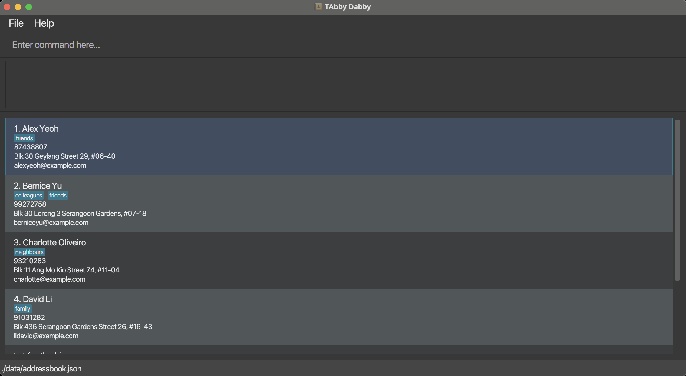
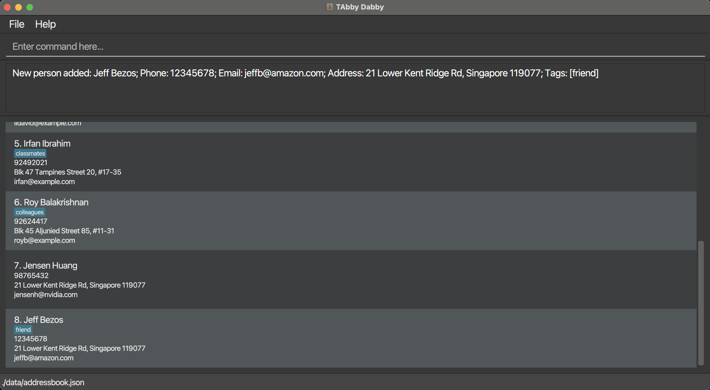
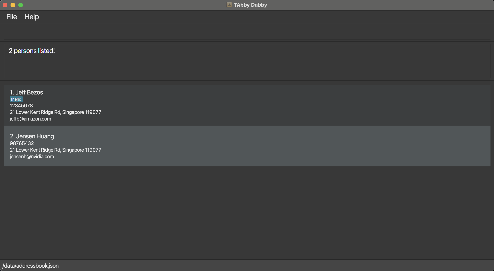
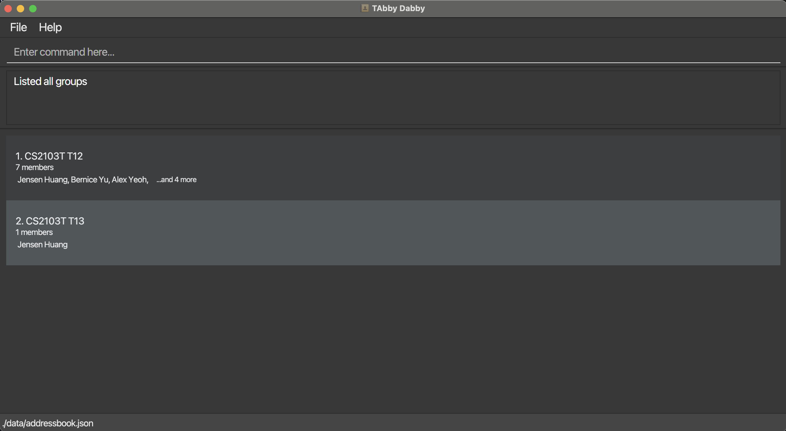

TAbby Dabby is a **desktop app designed for teaching assistants, optimised for use via a Command Line Interface** (CLI) while still having the benefits of a Graphical User Interface (GUI). If you can type fast, it can get your administrative tasks done faster than traditional GUI apps.
At a glance, TAbby Dabby allows you to:

- Manage contacts of students in their tutorial groups
- Track student attendance
- Track students' assignment scores

- Table of Contents
{:toc}

---

## Quick start

1. Ensure you have Java `17` or above installed in your Computer. 
   **Mac users:** Ensure you have the precise JDK version specified [here](https://se-education.org/guides/tutorials/javaInstallationMac.html).

2. Download the latest `TAbbyDabby.jar` file from [here](https://github.com/AY2425S2-CS2103T-T12-1/tp/releases).

3. Copy the file to the folder you want to use as the _home folder_ for your TAbby Dabby.

4. Open a command terminal, `cd` into the folder you put the jar file in, and use the `java -jar TAbbyDabby.jar` command to run the application. 
   A GUI similar to the below should appear in a few seconds. Note how the app contains some sample data. 
   

5. Type the command in the command box and press Enter to execute it. e.g. typing **`help`** and pressing Enter will open the help window. 
   Some example commands you can try:

   - `add n/Jensen Huang p/98765432 e/jensenh@nvidia.com a/21 Lower Kent Ridge Rd, Singapore 119077` : Adds a person named `Jensen Huang` to the list of persons.

   - `delete 3` : Deletes the 3rd person shown in the current person list.

   - `list` : Lists all persons.

   - `clear` : Deletes all persons.

   - `add-group n/CS2103T T12` : Adds a new group named `CS2103T T12` to the list of groups.

   - `exit` : Exits the app.

6. Refer to the [Features](#features) below for details of each command.

---

## Features

**:information_source: Notes about the command format:** 

- Items in `UPPER_CASE` are compulsory fields you have to fill in. 
  e.g. in `add n/NAME`, `NAME` is a parameter which you can fill in as `add n/Jensen Huang`.

- Items in square brackets are optional. 
  e.g You can fill in `n/NAME [t/TAG]` as `n/Jensen Huang t/friend` or as `n/Jensen Huang`.

- Items with `…`​ after them can be used multiple times including zero times. 
  e.g. `[t/TAG]…​` can be used as ` ` (i.e. 0 times), `t/friend`, `t/friend t/family` etc.

- You can fill in fields in any order. 
  e.g. if the command specifies `n/NAME p/PHONE_NUMBER`, `p/PHONE_NUMBER n/NAME` is also acceptable.

- Redundant parameters for commands that do not take in parameters (such as `help`, `list`, `exit` and `clear`) will be ignored. 
  e.g. if the command specifies `help 123`, it will be interpreted as `help`.

- If you type a command with a wrong format, TAbby Dabby will display an example to guide you to re-input the command correctly.

- If you are using a PDF version of this document, be careful when copying and pasting commands that span multiple lines as space characters surrounding line-breaks may be omitted when copied over to the application.

### Viewing help: `help`

Shows a message explaining how to access the help page.

Format: `help`

### Adding a person: `add`

Adds a person to the person list.
Useful for adding details of your students.

Format: `add n/NAME p/PHONE_NUMBER e/EMAIL a/ADDRESS [t/TAG]…​`

:bulb: **Tip:**
A person can have any number of tags (including 0)

- Person names must be alphanumeric and can contain spaces, e.g., `Jensen Huang`, `Jeff Bezos`.
- Person names must be unique.

Examples:

- `add n/Jensen Huang p/98765432 e/jensenh@nvidia.com a/21 Lower Kent Ridge Rd, Singapore 119077 t/friends`
- `add n/Jeff Bezos p/12345678 t/friend e/jeffb@amazon.com a/21 Lower Kent Ridge Rd, Singapore 119077`

Example of result of `add` command:

### Deleting a person: `delete`

<!-- TODO: add an image depicting deleting a person -->

Deletes the specified person from the person list.
Useful for removing the details of someone who is no longer a student.

Format: `delete INDEX`

- `INDEX` refers to the index number of the person in the last displayed person list. It **must be a positive integer** 1, 2, 3, …​

Examples:

- `list` followed by `delete 2` deletes the second person in the person list.
- `find Jensen` followed by `delete 1` deletes the first person in the results of the `find` command.

### Editing a person: `edit`

Edits the details of the specified person in the person list.

Format: `edit INDEX [n/NAME] [p/PHONE] [e/EMAIL] [a/ADDRESS] [t/TAG]…​`

- `INDEX` refers to the index number of the person in the last displayed person list. It **must be a positive integer** 1, 2, 3, …​
- You must fill in at least one of the optional fields.
- Existing values will be updated to the input values.
- When editing tags, the existing tags of the person will be removed, e.g., if the person at index `2` currently has the tag `frenemy`, and we run the command `edit 2 t/enemy`, the tag `frenemy` will be removed, and a new tag `enemy` will be added.
- You can remove all the person’s tags by typing `t/` without specifying any tags after it.
- Person names must be alphanumeric and can contain spaces, e.g., `Jensen Huang`, `Jeff Bezos`.
- Person names must be unique.

Examples:

- `edit 1 p/91234567 e/jensenh@yahoo.com` Edits the phone number and email address of the 1st person to be `91234567` and `jensenh@yahoo.com` respectively.
- `edit 2 n/Jeff Bezos t/` Edits the name of the 2nd person to be `Jeff Bezos` and clears all existing tags.
- `edit 2 n/Jeff Bezos t/friend` Edits the name of the 2nd person to be `Jeff Bezos`, clears all existing tags, and adds the tag `friend`.

### Listing all persons: `list`

Shows a list of all persons in the person list.

Format: `list`

### Finding persons by name: `find`

Finds persons whose names contain any of the specified keywords.

Format: `find KEYWORD [MORE_KEYWORDS]...`

- The search is case-insensitive, e.g., `jensen` will match `Jensen`.
- The order of the keywords does not matter. e.g. `Huang Jensen` will match `Jensen Huang`.
- Only the name is searched.
- Only full words will be matched, e.g., `Jen` will not match `Jens`.
- Persons matching at least one keyword will be returned (i.e. `OR` search), e.g., `Jensen Bezos` will return `Jensen Huang` and `Jeff Bezos`.

Examples:

- `find huang jensen` returns `huang jensen`, `jensen huang`, and `Jensen Huang`.
- `find huang bezos` returns `Jensen Huang` and `Jeff Bezos`.

Example of result of `find huang bezos` command:

### Deleting all persons: `clear`

Deletes all persons from the person list.

Format: `clear`

### Adding a new group: `add-group`

Adds a new group to the group list.
Useful for adding new tutorial groups.

Format: `add-group n/GROUP_NAME [t/TAG]...`

:bulb: **Tip:**
A group can have any number of tags (including 0)

- Group names must be alphanumeric and can contain spaces, e.g., `CS2103T T12`, `CS2101 T13`.
- Group names must be unique.

Examples:

- `add-group n/CS2103T T12 t/CS` creates a group with name `CS2103T T12` and the tag `CS`.

### Deleting a group: `delete-group`

Deletes the specified group from the group list.
Useful for removing a tutorial group that is no longer needed.

Format: `delete-group INDEX`

- `INDEX` refers to the index number of the group in the last displayed group list. It **must be a positive integer** 1, 2, 3, …​

Examples:

- `delete-group 2` deletes the group with index `2` in the last shown group list.

### Editing a group: `edit-group`

Edits the specified group details in the group list.

Format: `edit-group INDEX [n/GROUP_NAME] [t/TAG]…​`

- `INDEX` refers to the index number of the group in the last displayed group list. It **must be a positive integer** 1, 2, 3, …​
- At least one of the optional fields must be provided.
- Existing values will be updated to the input values.
- When editing tags, the existing tags of the group will be removed, e.g., if the group at index `2` currently has the tag `gaming`, and we run the command `edit-group 2 t/study`, the tag `gaming` will be removed, and a new tag `study` will be added.
- You can remove all the group’s tags by typing `t/` without specifying any tags after it.
- Group names must be alphanumeric and can contain spaces, e.g., `CS2103T T12`, `CS2101 T13`.
- Group names must be unique.

Examples:

- `edit-group 1 n/CS2103T T12` Edits the name of the first group to be `CS2103T T12`.
- `edit-group 2 n/CS2103T T12 t/` Edits the name of the second group to be `CS2103T T12` and clears all existing tags.
- `edit-group 2 n/CS2103T T12 t/study t/friends` Edits the name of the second group to be `CS2103T T12`, clears all existing tags, and adds the tags `study` and `friends`.

### Listing all groups: `list-group`

Shows a list of all groups in the group list along with their information, e.g., indices and names.

Format: `list-group`

Example of the result of the `list-group` command:

### Finding a group by name: `find-group`

Finds groups whose names contain any of the given keywords.

Format: `find-group KEYWORD [MORE_KEYWORDS]`

- The search is case-insensitive, e.g., `cs2103t t12` will match `CS2103T T12`.
- The order of the keywords does not matter. e.g. `T12 CS2103T` will match `CS2103T T12`.
- Only the name is searched.
- Only full words will be matched, e.g., `CS210` will not match `CS2103T`.
- Persons matching at least one keyword will be returned (i.e. `OR` search), e.g., `CS2103T T13` will return `CS2103T T12` and `CS2101 T13`.

Examples:

- `find-group T12` returns `T12`, `t12`, and `CS2103T T12`.
- `find-group t12 t13` returns `CS2103T T12` and `CS2103T T13`.

### Adding a person to a group: `add-to-group`

Adds the specified person to the specified group.

Format: `add-to-group P/PERSON_NAME g/GROUP_NAME`

- `PERSON_NAME` and `GROUP_NAME` are the names of a person and a group respectively.

Examples:

- `add-to-group P/Jensen Huang g/CS2103T T12` adds the person named `Jensen Huang` to the group named `CS2103T T12`.

### Removing a person from a group: `delete-from-group`

Removes the specified person from the specified group.

Format: `delete-from-group P/PERSON_NAME g/GROUP_NAME`

- `PERSON_NAME` and `GROUP_NAME` are the names of a person and a group respectively.

Examples:

- `delete-from-group P/Jensen Huang g/CS2103T T12` removes the person named `Jensen Huang` from the group named `CS2103T T12`.

### Showing group details: `show-group-details`

Shows the key details regarding the specified group.

Format: `show-group-details INDEX`

- Shows details including:
  - Group name and tags
  - Number of group members
  - Name, role, and attendance of every group member
- The index refers to the index number shown in the last displayed group list. The index **must be a positive integer** 1, 2, 3, …​

Examples:

- `show-group-details 2` shows all the details of the group with index `2` in the last shown group list.

### Marking the attendance of a person: `mark-attendance`

Marks the attendance of the specified person in the specified group for the specified week.

Format: `mark-attendance P/PERSON_NAME g/GROUP_NAME w/WEEK_NUMBER`

- `PERSON_NAME` is the name of the student.
- `GROUP_NAME` is the name of the group.
- `WEEK_NUMBER` must be a positive integer between 1 and 13 (inclusive).

Example:

- `mark-attendance P/Jensen Huang g/CS2103T T12 w/10` marks the attendance for `Jensen Huang` in `CS2103T T12` for week `10`.

### Unmarking the attendance of a person: `unmark-attendance`

Removes the attendance record of the specified person in the specified group for the specified week.

Format: `unmark-attendance P/NAME g/GROUP_NAME w/WEEK_NUMBER`

- `NAME` is the name of the student.
- `GROUP_NAME` is the name of the group.
- `WEEK_NUMBER` must be a positive integer between 1 and 13 (inclusive).

Example:

- `unmark-attendance P/Jensen Huang g/CS2103T T12 w/10` unmarks the attendance for `Jensen Huang` in `CS2103T T12` for week `10`.

### Showing the attendance records for a person: `show-attendance`

Displays the attendance record of the specified person in the specified group.

Format: `show-attendance P/NAME g/GROUP_NAME`

- `NAME` is the name of the student.
- `GROUP_NAME` is the name of the group.

Example:

- `show-attendance P/Jensen Huang g/CS2103T T12` displays the attendance for `Jensen Huang` in `CS2103T T12`.

### Adding an assignment in a group: `add-assignment`

Adds a new assignment in the specified group.

Format: `add-assignment n/ASSIGNMENT_NAME g/GROUP_NAME d/DEADLINE l/LATE_PENALTY`

- `ASSIGNMENT_NAME` is the name of the assignment.
- `GROUP_NAME` is the name of the group.
- `DEADLINE` is the deadline of the assignment in the format `DD-MM-YYYY`.
- `LATE_PENALTY` is a decimal between `0.0` and `1.0` (inclusive) representing the penalty multiplier for late submissions.

Example:

- `add-assignment n/HW 1 g/CS2103T T12 d/21-04-2025 l/0.875` adds an assignment named `HW 1` to the group `CS2103T T12` with a deadline of `21-04-2025` and a late penalty multiplier of `87.5%`.

### Deleting an assignment in a group: `delete-assignment`

Deletes an assignment in the specified group.

Format: `delete-assignment n/ASSIGNMENT_NAME g/GROUP_NAME`

- `ASSIGNMENT_NAME` is the name of the assignment.
- `GROUP_NAME` is the name of the group.

Example:

- `delete-assignment n/HW 1 g/CS2103T T12` deletes the assignment named `HW 1` in the group `CS2103T T12`.

### Grading an assignment in a group: `grade-assignment`

Grades the assignment submission by a person in a group.

Format: `delete-assignment P/PERSON_NAME g/GROUP_NAME A/ASSIGNMENT_NAME s/FLOAT_SCORE`

- `ASSIGNMENT_NAME` is the name of the assignment.
- `PERSON_NAME` is the name of the person.
- `GROUP_NAME` is the name of the group.
- `FLOAT_SCORE` is a decimal representing the score of the assignment submission.

Example:

- `grade-assignment P/Jensen Huang g/CS2103T T12 A/HW 1 s/70.3` grades the assignment `HW 1` for `Jensen Huang` in `CS2103T T12` with a score of `70.3`.

### Exiting the program: `exit`

Exits the program.

Format: `exit`

---

### Saving the data

TAbby Dabby's data is saved in your computer's hard disk automatically after any command that changes the data. There is no need to save manually.

### Editing the data file

You can find TAbby Dabby's data as a JSON file `[JAR file location]/data/addressbook.json`. Advanced users are welcome to update data directly by editing that data file.

:exclamation: **Caution:**
If your changes to the data file makes its format invalid, TAbby Dabby will discard all data and start with a new set of preloaded data at the next run.
Hence, it is recommended to take a backup of the file before editing it. 
Furthermore, certain edits can cause the TAbby Dabby to behave in unexpected ways (e.g., if a value entered is outside of the acceptable range).
Therefore, edit the data file only if you are confident that you can update it correctly.

---

## FAQ

**Q**: How do I transfer my data to another Computer? 
**A**: Install the app in the other computer and overwrite the empty data file it creates with the file that contains the data of your previous TAbby Dabby home folder. 
:bulb: **Refresher:** You can find the data file in TAbby Dabby's home folder at /data/addressbook.json.

---

## Known issues

1. **When using multiple screens**, if you move the application to a secondary screen, and later switch to using only the primary screen, the GUI will open off-screen. The remedy is to delete the `preferences.json` file created by the application before running the application again.
2. **If you minimise the Help Window** and then run the `help` command (or use the `Help` menu, or the keyboard shortcut `F1`) again, the original Help Window will remain minimised, and no new Help Window will appear. The remedy is to manually restore the minimised Help Window.

---

## Command summary

| Action                 | Format, Examples                                                                                                                                                  |
| ---------------------- | ----------------------------------------------------------------------------------------------------------------------------------------------------------------- |
| **Add**                | `add n/NAME p/PHONE_NUMBER e/EMAIL a/ADDRESS [t/TAG]…​`   e.g. `add n/Jensen Huang p/98765432 e/jensenh@nvidia.com a/21 Lower Kent Ridge Rd, Singapore 119077` |
| **Delete**             | `delete INDEX`  e.g. `delete 3`                                                                                                                                |
| **Edit**               | `edit INDEX [n/NAME] [p/PHONE_NUMBER] [e/EMAIL] [a/ADDRESS] [t/TAG]…​`  e.g. `edit 2 n/Jensen Huang e/jensenh@yahoo.com`                                       |
| **List**               | `list`                                                                                                                                                            |
| **Find**               | `find KEYWORD [MORE_KEYWORDS]`  e.g. `find huang jensen`                                                                                                       |
| **Clear**              | `clear`                                                                                                                                                           |
| **Add Group**          | `add-group n/GROUP_NAME`   e.g. `add-group n/CS2103T T12`                                                                                                      |
| **Delete Group**       | `delete-group INDEX`   e.g. `delete-group 1`                                                                                                                   |
| **Edit Group**         | `edit-group INDEX [n/GROUP_NAME] [t/TAG]…​`   e.g. `edit-group 1 n/CS2103 T12 t/study`                                                                         |
| **List Group**         | `list-group`                                                                                                                                                      |
| **Find Group**         | `find-group KEYWORD [MORE_KEYWORDS]`   e.g. `find-group CS2103T T12`                                                                                           |
| **Add to Group**       | `add-to-group P/PERSON_NAME g/GROUP_NAME`   e.g. `add-to-group P/Jensen Huang g/CS2103T T12`                                                                   |
| **Delete from Group**  | `delete-from-group P/PERSON_NAME g/GROUP_NAME`   e.g. `delete-from-group P/Jensen Huang g/CS2103T T12`                                                         |
| **Show Group Details** | `show-group-details INDEX`   e.g. `show-group-details 1`                                                                                                       |
| **Mark Attendance**    | `mark-attendance P/NAME g/GROUP_NAME w/WEEK_NUMBER`   e.g. `mark-attendance P/Jensen Huang g/CS2103T T12 w/10`                                                 |
| **Unmark Attendance**  | `unmark-attendance P/NAME g/GROUP_NAME w/WEEK_NUMBER`   e.g. `unmark-attendance P/Jensen Huang g/CS2103T T12 w/10`                                             |
| **Show Attendance**    | `show-attendance P/NAME g/GROUP_NAME`   e.g. `show-attendance P/Jensen Huang g/CS2103T T12`                                                                    |
| **Add Assignment**     | `add-assignment n/ASSIGNMENT_NAME g/GROUP_NAME d/DEADLINE l/LATE_PENALTY`   e.g. `add-assignment n/HW 1 g/CS2103T T12 d/21-04-2025 l/0.875`                    |
| **Delete Assignment**  | `delete-assignment n/ASSIGNMENT_NAME g/GROUP_NAME`   e.g. `delete-assignment n/HW 1 g/CS2103T T12`                                                             |
| **Grade Assignment**   | `grade-assignment P/PERSON_NAME g/GROUP_NAME A/ASSIGNMENT_NAME s/FLOAT_SCORE`   e.g. `grade-assignment P/Jensen Huang g/CS2103T T12 A/HW 1 s/70.3`             |
| **Help**               | `help`                                                                                                                                                            |
| **Exit**               | `exit`                                                                                                                                                            |
