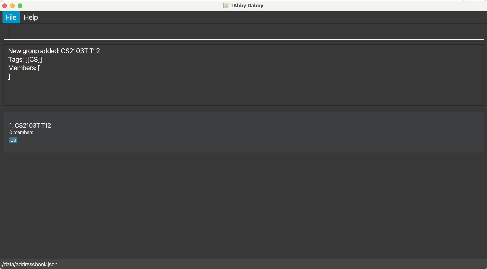
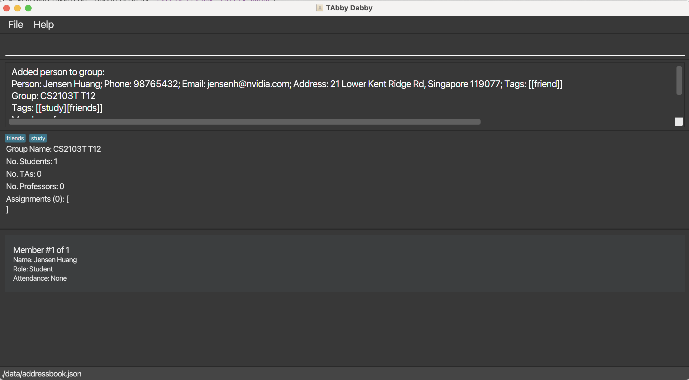
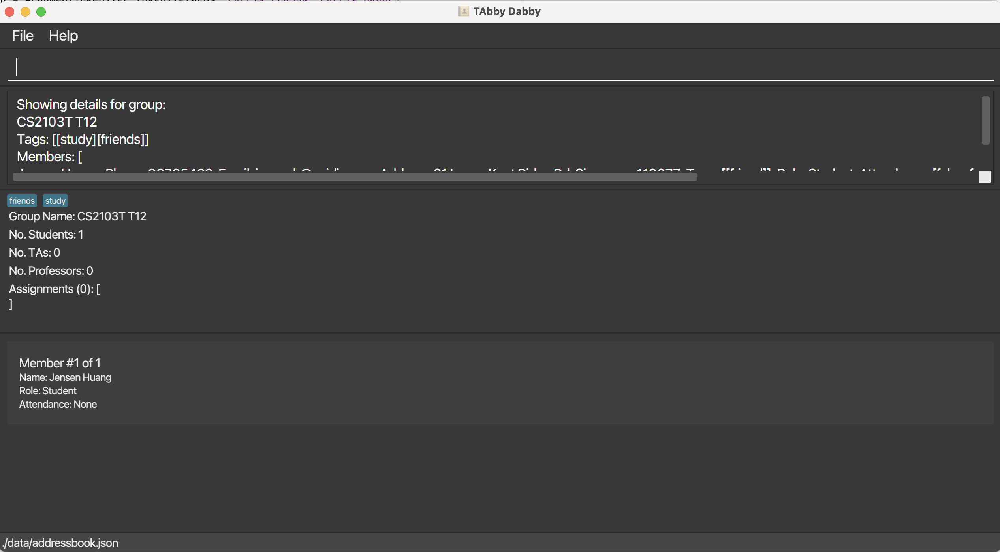

TAbby Dabby is a **desktop app to help teaching assistants (TAs) with their administrative duties**.
It is optimised for TAs who are comfortable using a command line interface (CLI) but still want a graphical user interface (GUI).
If you are a TA who can type fast, TAbby Dabby can get your administrative tasks done faster than traditional GUI apps.

- Table of Contents
{:toc}

---

## Introduction

TAbby Dabby helps TAs with four main tasks:
- Managing the contact details of students, co-TAs, and lecturers. TAbby Dabby calls these people **Persons**.
- Managing the tutorial groups that you are a part of. TAbby Dabby calls these tutorial groups **Groups**.
- Tracking the attendance of students in your tutorial groups. TAbby Dabby calls this **Attendance**.
- Tracking the assignments of your tutorial groups. TAbby Dabby calls these **Assignments**.

This User Guide uses the terms **Persons**, **Groups**, **Attendance**, and **Assignment** frequently to refer to these entities.

**:information_source: Relationship between each entity** 

- Each **Group** can have multiple **Persons** (members) in it, and each **Person** can be a member of multiple **Groups**.
- Each **Group** can have multiple **Assignments** in it, but each **Assignment** can only belong to one **Group**.
- Each **Person** has an **Attendance** record for each **Group** they belong to, and each **Group** has an **Attendance** record for each **Person** in it.

There are two separate lists in this app: the person list and the group list.
The person list contains all the persons, while the group list contains all the groups.

## Quick start

1. Ensure you have Java `17` or above installed in your Computer. 
   **Mac users:** Ensure you have the precise JDK version specified [here](https://se-education.org/guides/tutorials/javaInstallationMac.html).

2. Download the latest `TAbbyDabby.jar` file from [here](https://github.com/AY2425S2-CS2103T-T12-1/tp/releases).

3. Copy the file to the folder you want to use as the _home folder_ for your TAbby Dabby.

4. Open a command terminal, `cd` into the folder you put the jar file in, and use the `java -jar TAbbyDabby.jar` command to run the application. 
   The following GUI should appear in a few seconds. Note how the app contains some sample data. 
   

5. Type the command in the command box and press Enter to execute it. e.g. typing **`help`** and pressing Enter will open the help window. 
   Some example commands you can try:

   - `add n/Jensen Huang p/98765432 e/jensenh@nvidia.com a/21 Lower Kent Ridge Rd, Singapore 119077` : Adds a person named `Jensen Huang` to the list of persons.

   - `delete 3` : Deletes the 3rd person shown in the current person list.

   - `list` : Lists all persons.

   - `clear` : Deletes all persons.

   - `add-group n/CS2103T T12` : Adds a new group named `CS2103T T12` to the list of groups.

   - `exit` : Exits the app.

6. Refer to the [Features](#features) below for details of each command.

---

## General notes about using the app

### Command formats

**:information_source: Notes about command format** 

- Fields in square brackets are optional; every other field is compulsory. 
  e.g You can fill in `n/NAME [t/TAG]` as `n/Jensen Huang t/friend` or as `n/Jensen Huang`, but not as `t/friend`.

- Fields with `…`​ after them can be used multiple times including zero times. 
  e.g. `[t/TAG]…​` can be used as ` ` (i.e. 0 times), `t/friend`, `t/friend t/family` etc.

- You can fill in fields in any order. 
  e.g. if the command specifies `n/NAME p/PHONE_NUMBER`, `p/PHONE_NUMBER n/NAME` is also acceptable.

- Redundant parameters for commands that do not take in parameters (such as `help`, `list`, `exit` and `clear`) will be ignored. 
  e.g. if the command specifies `help 123`, it will be interpreted as `help`.

- If you type a command with a wrong format, TAbby Dabby will display an example to guide you to re-input the command correctly.

- If you are using a PDF version of this document, be careful when copying and pasting commands that span multiple lines as space characters surrounding line-breaks may be omitted when copied over to the application.

### Common fields

Many of our commands also share similar fields.
Here are some notes on them:

**:information_source: Notes about common fields** 

- NAME-related and TAG fields are case-sensitive, and must contain only alphanumeric characters, spaces, apostrophes, slashes, and dashes. This includes the `n/`, `g/`, and `t/` fields. 
  e.g. `Jensen-Huang s/o Michael O'Neil` and `jensen-huang s/o michael o'neil` are valid and distinct names and tags.

- NAME-related fields must be unique within the same category. 
  e.g. If you add a person with the name `Jensen Huang`, you cannot add another person with the same name. Same goes for groups.

- Duplicate TAGs are merged. 
  e.g. If you add a person with the fields `t/friend t/friend`, the person will only have one tag `friend`.

- INDEX fields refer to the index number of the person (resp. group) in the person (resp. group) list that was last displayed. It **must be a positive integer** 1, 2, 3, …, up till the number of persons (resp. groups) in the list.

## Commands

### General commands

#### Viewing help: `help`

Shows a message explaining how to access the help page.

**Expected output**

Format: `help`

**Expected output**

The GUI displays a pop-up window with a link to this User Guide.

Example result of `help`:

#### Exiting the program: `exit`

Exits the program.

Format: `exit`

**Expected output**

The GUI closes and the app terminates.

### Person commands

#### Adding a person: `add`

Adds a person to the person list.
Useful for adding details of your students.

Format: `add n/NAME p/PHONE_NUMBER e/EMAIL a/ADDRESS [t/TAG]…​`

**Notes**

- Phone numbers must have between 3 and 15 digits; they need not be unique.

**Examples**

- `add n/Jensen Huang p/98765432 e/jensenh@nvidia.com a/21 Lower Kent Ridge Rd, Singapore 119077 t/friend`
- `add n/Jeff Bezos p/12345678 t/friend e/jeffb@amazon.com a/21 Lower Kent Ridge Rd, Singapore 119077`

**Expected output**

The GUI displays the person list with the new person added to the end of it.

Example result of `add n/Jensen Huang p/98765432 e/jensenh@nvidia.com a/21 Lower Kent Ridge Rd, Singapore 119077 t/friends`:

#### Deleting a person: `delete`

Deletes the specified person from the person list.
Useful for removing the details of someone who is no longer a student.

Format: `delete INDEX`

**Examples**

- `list` followed by `delete 2` deletes the second person in the person list.
- `find Jensen` followed by `delete 1` deletes the first person in the results of the `find` command. Find out more about the `find` command [here](#finding-persons-by-name-find).

**Expected output**

The GUI displays the person list, just like with the [add](#adding-a-person-add) command, but with the specified person removed from it.
The persons that came after the deleted person will shift up to fill the gap and their indices will be updated accordingly.

Before running `delete 1`:

After running `delete 1`:

#### Editing a person: `edit`

Edits the details of the specified person in the person list.

Format: `edit INDEX [n/NAME] [p/PHONE] [e/EMAIL] [a/ADDRESS] [t/TAG]…​`

**Notes**

- You must fill in at least one of the optional fields.
- Existing values will be updated to the input values.
- When editing tags, the existing tags of the person will be removed, e.g., if the person at index `2` currently has the tag `frenemy`, and we run the command `edit 2 t/enemy`, the tag `frenemy` will be removed, and a new tag `enemy` will be added.
- You can remove all the person’s tags by typing `t/` without specifying any tags after it.

**Examples**

- `edit 1 p/91234567 e/jensenh@yahoo.com` Edits the phone number and email address of the 1st person to be `91234567` and `jensenh@yahoo.com` respectively.
- `edit 2 n/Jeff Bezos t/` Edits the name of the 2nd person to be `Jeff Bezos` and clears all existing tags.
- `edit 2 n/Jeff Bezos t/friend` Edits the name of the 2nd person to be `Jeff Bezos`, clears all existing tags, and adds the tag `friend`.

**Expected output**

Example result of `edit 1 p/91234567 e/jensenh@yahoo.com t/buddy`:

#### Listing all persons: `list`

Shows a list of all persons in the person list.

Format: `list`

**Expected output**

The GUI displays a list of all persons in the person list.

#### Finding persons by name: `find`

Finds persons whose names contain any of the specified keywords.

Format: `find KEYWORD [MORE_KEYWORDS]...`

**Notes**

- The search is case-insensitive, e.g., `jensen` will match `Jensen`.
- The order of the keywords does not matter. e.g. `Huang Jensen` will match `Jensen Huang`.
- Only the name is searched.
- Only full words will be matched, e.g., `Jen` will not match `Jens`.
- Persons matching at least one keyword will be returned (i.e. `OR` search), e.g., `Jensen Bezos` will return `Jensen Huang` and `Jeff Bezos`.

**Examples**

- `find huang jensen` may output `huang jensen`, `jensen huang`, and `Jensen Huang`.
- `find huang bezos` may output `Jensen Huang` and `Jeff Bezos`.

**Expected output**

The GUI displays a list of persons whose names contain any of the specified keywords.

Example result of executing the `find huang bezos` command:

#### Deleting all persons: `clear`

Deletes all persons from the person list.

Format: `clear`

**Expected output**

The GUI displays an empty person list.

### Group commands

#### Adding a new group: `add-group`

Adds a new group to the group list.
Useful for adding new tutorial groups.

Format: `add-group n/GROUP_NAME [t/TAG]...`

**Examples**

- `add-group n/CS2103T T12 t/CS` creates a group with name `CS2103T T12` and the tag `CS`.

**Expected output**

The GUI displays the group list with the new group added to the end of it.

Example result of `add-group n/CS2103T T12 t/CS`:

#### Deleting a group: `delete-group`

Deletes the specified group from the group list.
Useful for removing a tutorial group that is no longer needed.

Format: `delete-group INDEX`

**Examples**

- `delete-group 2` deletes the group with index `2` in the last shown group list.

**Expected output**

The GUI displays the group list, just like with the [add-group](#adding-a-new-group-add-group) command, but with the specified group removed from it.

#### Editing a group: `edit-group`

Edits the specified group details in the group list.

Format: `edit-group INDEX [n/GROUP_NAME] [t/TAG]…​`

**Notes**

- At least one of the optional fields must be provided.
- Existing values will be updated to the input values.
- When editing tags, the existing tags of the group will be removed, e.g., if the group at index `2` currently has the tag `gaming`, and we run the command `edit-group 2 t/study`, the tag `gaming` will be removed, and a new tag `study` will be added.
- You can remove all the group’s tags by typing `t/` without specifying any tags after it.

**Examples**

- `edit-group 1 n/CS2103T T12` Edits the name of the first group to be `CS2103T T12`.
- `edit-group 2 n/CS2103T T12 t/` Edits the name of the second group to be `CS2103T T12` and clears all existing tags.
- `edit-group 2 n/CS2103T T12 t/study t/friends` Edits the name of the second group to be `CS2103T T12`, clears all existing tags, and adds the tags `study` and `friends`.

**Expected output**

The GUI displays the specified group's updated details, like with [show-group-details](#showing-group-details-show-group-details).

Note: this differs from the output of the analogous `edit` command for persons, which displays the person list instead.

Example result of `edit-group 1 n/CS2103T T12 t/study t/friends`:

#### Listing all groups: `list-group`

Shows a list of all groups in the group list along with their information, e.g., indices and names.

Format: `list-group`

**Expected output**

The GUI displays a list of all groups in the group list.

Example result of `list-group`:

#### Finding a group by name: `find-group`

Finds groups whose names contain any of the given keywords.

Format: `find-group KEYWORD [MORE_KEYWORDS]`

**Notes**

- The search is case-insensitive, e.g., `cs2103t t12` will match `CS2103T T12`.
- The order of the keywords does not matter. e.g. `T12 CS2103T` will match `CS2103T T12`.
- Only the name is searched.
- Only full words will be matched, e.g., `CS210` will not match `CS2103T`.
- Groups matching at least one keyword will be returned (i.e. `OR` search), e.g., `CS2103T T13` will return `CS2103T T12` and `CS2101 T13`.

**Examples**

- `find-group T12` may output `T12`, `t12`, and `CS2103T T12`.
- `find-group t12 t13` may output `CS2103T T12` and `CS2103T T13`.

**Expected output**

The GUI displays a list of groups whose names contain any of the specified keywords.

Example result of executing the `find-group t12 t13` command:

#### Adding a person to a group: `add-to-group`

Adds the specified person to the specified group.

Format: `add-to-group n/PERSON_NAME g/GROUP_NAME`

**Examples**

- `add-to-group n/Jensen Huang g/CS2103T T12` adds the person named `Jensen Huang` to the group named `CS2103T T12`.

**Expected output**

The GUI displays the specified group's updated details, like with [show-group-details](#showing-group-details-show-group-details), with the specified person added to it.

Example result of `add-to-group n/Jensen Huang g/CS2103T T12`:

**Known limitations**

- The person is assumed to be a student for now. We plan to support the addition of co-TAs and lecturers in the future.

#### Removing a person from a group: `delete-from-group`

Removes the specified person from the specified group.

Format: `delete-from-group n/PERSON_NAME g/GROUP_NAME`

**Examples**

- `delete-from-group n/Jensen Huang g/CS2103T T12` removes the person named `Jensen Huang` from the group named `CS2103T T12`.

**Expected output**

The GUI displays the specified group's updated details, like with [show-group-details](#showing-group-details-show-group-details), with the specified person removed from it.

#### Showing group details: `show-group-details`

Shows the key details regarding the specified group.

Format: `show-group-details INDEX`

**Examples**

- `show-group-details 2` shows all the details of the group with index `2` in the last shown group list.

**Expected output**

The GUI shows the details of the specified group, including:
  - Group name and tags
  - Number of students, TAs, lecturers, and assignments
  - Name, role, and attendance of every group member

Example result of `show-group-details 1`:

### Attendance commands

#### Marking the attendance of a person: `mark-attendance`

Marks the attendance of the specified person in the specified group for the specified week.

Format: `mark-attendance n/PERSON_NAME g/GROUP_NAME w/WEEK_NUMBER`

**Notes**

- `WEEK_NUMBER` must be a positive integer between 1 and 13 (inclusive).

**Examples**

- `mark-attendance n/Jensen Huang g/CS2103T T12 w/10` marks the attendance for `Jensen Huang` in `CS2103T T12` for week `10`.

**Expected output**

The GUI displays the specified group's updated details with the specified person's attendance marked for the specified week.

#### Unmarking the attendance of a person: `unmark-attendance`

Removes the attendance record of the specified person in the specified group for the specified week.

Format: `unmark-attendance n/PERSON_NAME g/GROUP_NAME w/WEEK_NUMBER`

**Notes**

- `WEEK_NUMBER` must be a positive integer between 1 and 13 (inclusive).

**Examples**

- `unmark-attendance n/Jensen Huang g/CS2103T T12 w/10` unmarks the attendance for `Jensen Huang` in `CS2103T T12` for week `10`.

**Expected output**

The GUI displays the specified group's updated details with the specified person's attendance unmarked for the specified week.

#### Showing the attendance records for a person: `show-attendance`

Displays the attendance record of the specified person in the specified group.

Format: `show-attendance n/PERSON_NAME g/GROUP_NAME`

**Examples**

- `show-attendance n/Jensen Huang g/CS2103T T12` displays the attendance for `Jensen Huang` in `CS2103T T12`.

**Expected output**

The GUI displays the specified person's attendance record for the specified group.

Example result of `show-attendance n/Jensen Huang g/CS2103T T12`:

### Assignment commands

#### Adding an assignment in a group: `add-assignment`

Adds a new assignment in the specified group.

Format: `add-assignment n/ASSIGNMENT_NAME g/GROUP_NAME d/DEADLINE`

**Notes**

- `ASSIGNMENT_NAME` is the name of the assignment.
- `GROUP_NAME` is the name of the group.
- `DEADLINE` is the deadline of the assignment in the format `DD-MM-YYYY`.

**Examples**

- `add-assignment n/HW 1 g/CS2103T T12 d/21-04-2025` adds an assignment named `HW 1` to the group `CS2103T T12` with a deadline of `21-04-2025`.

**Expected output**

The GUI displays the specified group's updated details with the new assignment added to it.

Example result of `add-assignment n/HW 1 g/CS2103T T12 d/21-04-2025`:

#### Deleting an assignment in a group: `delete-assignment`

Deletes an assignment in the specified group.

Format: `delete-assignment n/ASSIGNMENT_NAME g/GROUP_NAME`

**Notes**

- `ASSIGNMENT_NAME` is the name of the assignment.
- `GROUP_NAME` is the name of the group.

**Examples**

- `delete-assignment n/HW 1 g/CS2103T T12` deletes the assignment named `HW 1` in the group `CS2103T T12`.

**Expected output**

The GUI displays the specified group's updated details with the specified assignment removed from it.

#### Editing an assignment in a group: `edit-assignment`

Edits details of the specified assignment in the specified group.

Format: `edit-assignment n/ASSIGNMENT_NAME g/GROUP [N/NEW NAME] [d/DEADLINE]`

**Notes**

- `ASSIGNMENT_NAME` is the name of the assignment.
- `GROUP_NAME` is the name of the group.
- `NEW NAME` is the new name of the assignment.
- `DEADLINE` is the new deadline of the assignment in the format `DD-MM-YYYY`.

**Examples**

- `edit-assignment n/HW 1 g/CS2103T T12 N/Assignment 1 d/21-04-2025` renames the assignment named `HW 1` in the group `CS2103T T12` to `Assignment 1` with a deadline of `21-04-2025`.

**Expected output**

The GUI displays the specified group's updated details with the specified assignment's details updated.

---

### Saving the data

TAbby Dabby's data is saved in your computer's hard disk automatically after any command that changes the data. There is no need to save manually.

### Editing the data file

You can find TAbby Dabby's data as a JSON file `[JAR file location]/data/addressbook.json`. Advanced users are welcome to update data directly by editing that data file.

:exclamation: **Caution:**
If your changes to the data file makes its format invalid, TAbby Dabby will discard all data and start with a new set of preloaded data at the next run.
Hence, it is recommended to take a backup of the file before editing it. 
Furthermore, certain edits can cause the TAbby Dabby to behave in unexpected ways (e.g., if a value entered is outside of the acceptable range).
Therefore, edit the data file only if you are confident that you can update it correctly.

---

## FAQ

**Q**: How do I transfer my data to another Computer? 
**A**: Install the app in the other computer and overwrite the empty data file it creates with the file that contains the data of your previous TAbby Dabby home folder. 
:bulb: **Refresher:** You can find the data file in TAbby Dabby's home folder at /data/addressbook.json.

---

## Known issues

1. **When using multiple screens**, if you move the application to a secondary screen, and later switch to using only the primary screen, the GUI will open off-screen. The remedy is to delete the `preferences.json` file created by the application before running the application again.
2. **If you minimise the Help Window** and then run the `help` command (or use the `Help` menu, or the keyboard shortcut `F1`) again, the original Help Window will remain minimised, and no new Help Window will appear. The remedy is to manually restore the minimised Help Window.

---

## Command summary

| Action                 | Format, Examples                                                                                                                                                  |
| ---------------------- |-------------------------------------------------------------------------------------------------------------------------------------------------------------------|
| **Help**               | `help`                                                                                                                                                            |
| **Add**                | `add n/NAME p/PHONE_NUMBER e/EMAIL a/ADDRESS [t/TAG]…​`   e.g. `add n/Jensen Huang p/98765432 e/jensenh@nvidia.com a/21 Lower Kent Ridge Rd, Singapore 119077` |
| **Delete**             | `delete INDEX`  e.g. `delete 3`                                                                                                                                |
| **Edit**               | `edit INDEX [n/NAME] [p/PHONE_NUMBER] [e/EMAIL] [a/ADDRESS] [t/TAG]…​`  e.g. `edit 2 n/Jensen Huang e/jensenh@yahoo.com`                                       |
| **List**               | `list`                                                                                                                                                            |
| **Find**               | `find KEYWORD [MORE_KEYWORDS]`  e.g. `find huang jensen`                                                                                                       |
| **Clear**              | `clear`                                                                                                                                                           |
| **Add Group**          | `add-group n/GROUP_NAME`   e.g. `add-group n/CS2103T T12`                                                                                                      |
| **Delete Group**       | `delete-group INDEX`   e.g. `delete-group 1`                                                                                                                   |
| **Edit Group**         | `edit-group INDEX [n/GROUP_NAME] [t/TAG]…​`   e.g. `edit-group 1 n/CS2103 T12 t/study`                                                                         |
| **List Group**         | `list-group`                                                                                                                                                      |
| **Find Group**         | `find-group KEYWORD [MORE_KEYWORDS]`   e.g. `find-group CS2103T T12`                                                                                           |
| **Add to Group**       | `add-to-group n/PERSON_NAME g/GROUP_NAME`   e.g. `add-to-group n/Jensen Huang g/CS2103T T12`                                                                   |
| **Delete from Group**  | `delete-from-group n/PERSON_NAME g/GROUP_NAME`   e.g. `delete-from-group n/Jensen Huang g/CS2103T T12`                                                         |
| **Show Group Details** | `show-group-details INDEX`   e.g. `show-group-details 1`                                                                                                       |
| **Mark Attendance**    | `mark-attendance n/PERSON_NAME g/GROUP_NAME w/WEEK_NUMBER`   e.g. `mark-attendance n/Jensen Huang g/CS2103T T12 w/10`                                          |
| **Unmark Attendance**  | `unmark-attendance n/PERSON_NAME g/GROUP_NAME w/WEEK_NUMBER`   e.g. `unmark-attendance n/Jensen Huang g/CS2103T T12 w/10`                                      |
| **Show Attendance**    | `show-attendance n/PERSON_NAME g/GROUP_NAME`   e.g. `show-attendance n/Jensen Huang g/CS2103T T12`                                                             |
| **Add Assignment**     | `add-assignment n/ASSIGNMENT_NAME g/GROUP_NAME d/DEADLINE`   e.g. `add-assignment n/HW 1 g/CS2103T T12 d/21-04-2025`                                           |
| **Delete Assignment**  | `delete-assignment n/ASSIGNMENT_NAME g/GROUP_NAME`   e.g. `delete-assignment n/HW 1 g/CS2103T T12`                                                             |
| **Edit Assignment**    | `edit-assignment n/ASSIGNMENT NAME g/GROUP [N/NEW NAME] [d/DEADLINE]`   e.g. `edit-assignment n/HW 1 g/CS2103T T12 N/Assignment 1 d/21-04-2025`                |
| **Exit**               | `exit`                                                                                                                                                            |
